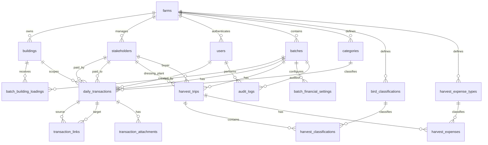

# Octavio Poultry Farm App Technical Specification

Version: 1.0
Status: Implementation source of truth
Scope: Replace the existing 8-sheet Excel workbook with a full-stack, multi-batch poultry farm management application.

## 1. Product Objective

Build a web and mobile-accessible farm management system for Octavio Poultry Farm that fully replaces the current Excel workbook.

The app must preserve all workbook functions across these sheets:

- Setup
- Daily_Log
- Harvest_Yield
- OPEX_Log
- CAPEX_Log
- Financial Statement
- Receivable
- Payable

The application must modernize spreadsheet formulas into normalized relational data, backend business logic, SQL reports, and role-aware UI screens. All operational and financial data must be scoped to a batch unless explicitly requested as a farm-level cross-batch report.

## 2. Core Requirements

1. Track broiler production by batch from chick loading to harvest and final profit distribution.
2. Support multiple historical and concurrent batches.
3. Preserve batch isolation for all financial, harvest, payable, and receivable calculations.
4. Provide mobile-friendly data entry for farm workers and operation managers.
5. Provide secure role-based access for owners, managers, workers, and external viewers.
6. Replace Excel formulas such as SUMIFS, IF chains, and lookup references with database queries and backend services.
7. Preserve printable/exportable financial statement output, including document-style layout and signature areas.
8. Maintain auditability for edits, deletes, financial adjustments, and owner-visible distribution rules.

## 3. Recommended Architecture

### 3.1 Application Stack

Use the existing direction of this repository unless the project is intentionally restarted:

- Frontend: React PWA with responsive layouts.
- Backend: Node.js and Express.
- Database: PostgreSQL.
- Authentication: JWT access tokens with secure password hashing.
- Authorization: backend-enforced RBAC with role-aware frontend rendering.
- Offline support: PWA service worker plus local queued mutations for mobile data entry.
- Report export: server-rendered PDF from HTML templates.

Dedicated mobile apps can be added later through React Native or Capacitor. The first production target should be a PWA because it gives mobile access, installability, and offline-friendly data entry without duplicating UI code.

### 3.2 Logical Components

- Web/PWA client: React screens, forms, dashboards, offline queue.
- API server: Express REST API, auth middleware, RBAC middleware, business services.
- Database: PostgreSQL schema, views, constraints, functions, indexes.
- Job runner: scheduled status refresh, materialized view refresh, stale offline sync checks.
- Export service: PDF and CSV generation.
- Audit logger: captures sensitive create/update/delete actions.

### 3.3 Key Design Principles

- Never calculate official financial totals only in the client.
- Every write operation must be validated by the backend.
- Every operational record must include `batch_id`.
- Every financial record must be traceable to a transaction, stakeholder, and user.
- Use internal UUID primary keys and separate human-readable codes.
- Use lookup tables for categories and classifications instead of hardcoded dropdown values.
- Use append-only audit records for sensitive financial changes.

## 4. Workbook-to-App Feature Mapping

| Excel Sheet | App Module | Primary Tables | Notes |
| --- | --- | --- | --- |
| Setup | Admin settings | farms, buildings, stakeholders, categories, users, bird_classifications | Replaces dropdown lists and lookup references. |
| Daily_Log | Daily transaction ledger | daily_transactions, transaction_links, attachments | General operational log for expense, income, adjustment, receivable, payable records. |
| Harvest_Yield | Harvest module | harvest_trips, harvest_classifications, harvest_expenses | Multiple trips per batch; classification totals are query-driven. |
| OPEX_Log | OPEX report | daily_transactions, vw_batch_opex_summary | Generated from ledger where funding_nature = OPEX. |
| CAPEX_Log | CAPEX report | daily_transactions, vw_batch_capex_summary | Generated from ledger where funding_nature IN (CAPEX, CAPEX-Recoverable). |
| Financial Statement | Financial report | batch_financial_settings, report views | Printable/exportable statement matching workbook structure. |
| Receivable | Receivables report | daily_transactions, transaction_links, stakeholders | Generated from receivable transactions and reimbursements. |
| Payable | Payables report | daily_transactions, transaction_links, stakeholders | Generated from expenses paid by stakeholders or unpaid supplier obligations. |

## 5. Domain Definitions

### 5.1 Batch

A batch is the central unit of production and financial reporting. All daily transactions, harvest entries, receivables, payables, and owner distribution computations must reference one batch.

`batch_code` is the human-readable identifier derived from loading date. Recommended format:

```text
BYYYYMMDD
```

Example:

```text
B20260509
```

If more than one batch starts on the same date, append a sequence:

```text
B20260509-02
```

### 5.2 Building

A building represents a physical house such as A, B, or C. Buildings are reusable across batches. A batch-specific loading record defines how many chicks were loaded into each building and the building's loading share for that batch.

### 5.3 Transaction

A daily transaction is the canonical financial ledger row. OPEX, CAPEX, receivables, payables, income, adjustments, reimbursements, sack sales, and manual deductions should all be represented as typed ledger transactions rather than separate spreadsheet rows.

### 5.4 Harvest Trip

A harvest trip represents a delivery to a dressing plant or buyer. Each trip has head counts and one or more classification rows containing kilos, price, and sales.

## 6. Database ER Diagram



## 7. PostgreSQL Schema

### 7.1 Conventions

- Use `uuid` primary keys generated by `gen_random_uuid()`.
- Use `timestamptz` for audit timestamps.
- Use `date` for farm business dates.
- Use `numeric(14,2)` for money.
- Use `numeric(14,3)` for weights and quantities.
- Use soft delete only where records are operationally sensitive.
- Add `created_at`, `updated_at`, `created_by_user_id`, and `updated_by_user_id` where useful.

Enable required extension:

```sql
CREATE EXTENSION IF NOT EXISTS pgcrypto;
```

### 7.2 Enum Types

```sql
CREATE TYPE batch_status AS ENUM ('INCOMING', 'ONGOING', 'CLOSED');
CREATE TYPE stakeholder_type AS ENUM ('Owner', 'Employee', 'Supplier', 'Buyer', 'Dressing Plant', 'Other');
CREATE TYPE user_role AS ENUM ('AdminOwner', 'OperationManager', 'DataEntry', 'Viewer');
CREATE TYPE transaction_type AS ENUM ('Expense', 'Income', 'Adjustment', 'Reimbursement');
CREATE TYPE funding_nature AS ENUM ('OPEX', 'CAPEX', 'Receivable', 'Payable', 'CAPEX-Recoverable', 'Other Revenue');
CREATE TYPE building_scope AS ENUM ('Specific', 'All');
CREATE TYPE link_type AS ENUM ('ReimbursementForAdvance', 'PaymentForPayable', 'AdjustmentForTransaction', 'Reversal');
```

### 7.3 Tables

#### farms

Stores farm identity and global settings.

| Column | Type | Constraints |
| --- | --- | --- |
| id | uuid | PK, default gen_random_uuid() |
| name | text | not null |
| legal_name | text | nullable |
| timezone | text | not null default 'Asia/Manila' |
| currency | text | not null default 'PHP' |
| settings | jsonb | not null default '{}' |
| created_at | timestamptz | not null default now() |
| updated_at | timestamptz | not null default now() |

#### buildings

Physical poultry houses.

| Column | Type | Constraints |
| --- | --- | --- |
| id | uuid | PK |
| farm_id | uuid | FK farms(id), not null |
| name | text | not null, examples 'A', 'B', 'C' |
| default_loading_share_pct | numeric(7,4) | nullable |
| is_active | boolean | not null default true |
| sort_order | int | not null default 0 |
| created_at | timestamptz | not null default now() |

Unique constraint:

```sql
UNIQUE (farm_id, name)
```

#### stakeholders

Master list of owners, employees, suppliers, buyers, dressing plants, and other contacts.

| Column | Type | Constraints |
| --- | --- | --- |
| id | uuid | PK |
| farm_id | uuid | FK farms(id), not null |
| display_name | text | not null |
| legal_name | text | nullable |
| type | stakeholder_type | not null |
| phone | text | nullable |
| email | text | nullable |
| address | text | nullable |
| metadata | jsonb | not null default '{}' |
| is_active | boolean | not null default true |
| created_at | timestamptz | not null default now() |

Indexes:

```sql
CREATE INDEX idx_stakeholders_farm_type ON stakeholders (farm_id, type);
```

Seed examples:

- Rolly, type Owner
- Rodney, type Owner
- Yanyan, type Employee
- Hardware Credit, type Supplier
- Gomez, type Supplier or Buyer depending on workbook usage
- Dressing plant entities, type Dressing Plant

#### users

App login accounts linked to stakeholders.

| Column | Type | Constraints |
| --- | --- | --- |
| id | uuid | PK |
| farm_id | uuid | FK farms(id), not null |
| stakeholder_id | uuid | FK stakeholders(id), nullable for system users |
| email | citext | unique, not null |
| password_hash | text | not null |
| role | user_role | not null |
| is_active | boolean | not null default true |
| last_login_at | timestamptz | nullable |
| created_at | timestamptz | not null default now() |
| updated_at | timestamptz | not null default now() |

Required extension for `citext`:

```sql
CREATE EXTENSION IF NOT EXISTS citext;
```

#### user_building_assignments

Limits workers or viewers to assigned buildings.

| Column | Type | Constraints |
| --- | --- | --- |
| id | uuid | PK |
| user_id | uuid | FK users(id), not null |
| building_id | uuid | FK buildings(id), not null |
| batch_id | uuid | FK batches(id), nullable |
| created_at | timestamptz | not null default now() |

If `batch_id` is null, the assignment applies to all batches.

#### batches

Central batch table.

| Column | Type | Constraints |
| --- | --- | --- |
| id | uuid | PK |
| farm_id | uuid | FK farms(id), not null |
| batch_code | text | unique, not null |
| start_date | date | not null |
| target_harvest_date | date | nullable |
| actual_harvest_end_date | date | nullable |
| status_override | batch_status | nullable |
| status | batch_status | not null default 'INCOMING' |
| total_chicks_loaded | int | not null default 0 |
| planned_flock | int | nullable |
| target_feed_kg | numeric(14,3) | nullable |
| notes | text | nullable |
| closed_at | timestamptz | nullable |
| created_by_user_id | uuid | FK users(id), nullable |
| created_at | timestamptz | not null default now() |
| updated_at | timestamptz | not null default now() |

Rules:

- `batch_code` is generated server-side.
- `status` is computed server-side unless `status_override` is set.
- `actual_harvest_end_date` should be set before a batch is closed.
- Data entry is allowed only for ONGOING batches unless AdminOwner overrides.

Indexes:

```sql
CREATE INDEX idx_batches_farm_status ON batches (farm_id, status);
CREATE INDEX idx_batches_farm_start_date ON batches (farm_id, start_date DESC);
```

#### batch_building_loadings

Links batches to buildings and stores loading counts per building.

| Column | Type | Constraints |
| --- | --- | --- |
| id | uuid | PK |
| batch_id | uuid | FK batches(id), not null |
| building_id | uuid | FK buildings(id), not null |
| loading_date | date | not null |
| chicks_loaded | int | not null default 0 |
| loading_share_pct | numeric(7,4) | nullable |
| remarks | text | nullable |
| created_at | timestamptz | not null default now() |

Constraints:

```sql
UNIQUE (batch_id, building_id)
CHECK (chicks_loaded >= 0)
CHECK (loading_share_pct IS NULL OR (loading_share_pct >= 0 AND loading_share_pct <= 100))
```

If `loading_share_pct` is null, calculate it as:

```text
chicks_loaded / SUM(chicks_loaded for batch) * 100
```

#### categories

Configurable dropdown values for transaction categories.

| Column | Type | Constraints |
| --- | --- | --- |
| id | uuid | PK |
| farm_id | uuid | FK farms(id), not null |
| funding_nature | funding_nature | not null |
| name | text | not null |
| description | text | nullable |
| is_system | boolean | not null default false |
| is_active | boolean | not null default true |
| sort_order | int | not null default 0 |

Unique constraint:

```sql
UNIQUE (farm_id, funding_nature, name)
```

Seed examples:

- OPEX: Feed, DOC, Medicine, Labor, Electricity, Water, Transportation, Permit, Cash Advance
- CAPEX: Building Repair, Equipment, Hardware, Farm Improvement
- Receivable: Cash Advance, Reimbursement
- Payable: Supplier Credit, Owner Paid Expense, Reimbursement Due
- Other Revenue: Empty Sack Sale, Miscellaneous Income
- CAPEX-Recoverable: Recoverable Hardware, Recoverable Equipment

#### daily_transactions

Canonical ledger table.

| Column | Type | Constraints |
| --- | --- | --- |
| id | uuid | PK |
| batch_id | uuid | FK batches(id), not null |
| transaction_code | text | unique, not null |
| transaction_date | date | not null |
| building_scope | building_scope | not null default 'Specific' |
| building_id | uuid | FK buildings(id), nullable |
| type | transaction_type | not null |
| funding_nature | funding_nature | not null |
| category_id | uuid | FK categories(id), not null |
| description | text | not null |
| quantity | numeric(14,3) | nullable |
| unit_cost | numeric(14,4) | nullable |
| manual_amount | numeric(14,2) | nullable |
| amount | numeric(14,2) | not null |
| paid_by_stakeholder_id | uuid | FK stakeholders(id), nullable |
| paid_to_stakeholder_id | uuid | FK stakeholders(id), nullable |
| reference | text | nullable |
| remarks | text | nullable |
| metadata | jsonb | not null default '{}' |
| is_void | boolean | not null default false |
| void_reason | text | nullable |
| created_by_user_id | uuid | FK users(id), not null |
| updated_by_user_id | uuid | FK users(id), nullable |
| created_at | timestamptz | not null default now() |
| updated_at | timestamptz | not null default now() |

Constraints:

```sql
CHECK (
  (building_scope = 'All' AND building_id IS NULL)
  OR
  (building_scope = 'Specific' AND building_id IS NOT NULL)
)
CHECK (amount >= 0)
CHECK (
  amount = COALESCE(ROUND(quantity * unit_cost, 2), manual_amount)
  OR manual_amount IS NOT NULL
)
```

Amount rule:

- If `quantity` and `unit_cost` are provided, backend sets `amount = round(quantity * unit_cost, 2)`.
- Otherwise, backend requires `manual_amount` and sets `amount = manual_amount`.

Index recommendations:

```sql
CREATE INDEX idx_transactions_batch_date ON daily_transactions (batch_id, transaction_date DESC);
CREATE INDEX idx_transactions_batch_funding ON daily_transactions (batch_id, funding_nature, type);
CREATE INDEX idx_transactions_paid_by ON daily_transactions (paid_by_stakeholder_id);
CREATE INDEX idx_transactions_paid_to ON daily_transactions (paid_to_stakeholder_id);
CREATE INDEX idx_transactions_category ON daily_transactions (category_id);
```

#### transaction_code_sequences

Prevents race conditions when generating transaction IDs.

| Column | Type | Constraints |
| --- | --- | --- |
| transaction_date | date | PK part |
| building_key | text | PK part, building name or 'ALL' |
| last_sequence | int | not null |
| updated_at | timestamptz | not null default now() |

Primary key:

```sql
PRIMARY KEY (transaction_date, building_key)
```

#### transaction_links

Links reimbursements, payments, adjustments, or reversals to original transactions.

| Column | Type | Constraints |
| --- | --- | --- |
| id | uuid | PK |
| source_transaction_id | uuid | FK daily_transactions(id), not null |
| target_transaction_id | uuid | FK daily_transactions(id), not null |
| link_type | link_type | not null |
| amount_applied | numeric(14,2) | not null |
| created_by_user_id | uuid | FK users(id), not null |
| created_at | timestamptz | not null default now() |

Use cases:

- Reimbursement settles a cash advance.
- Payment settles a supplier payable.
- Adjustment corrects a previous transaction.
- Reversal voids a transaction while preserving audit history.

#### transaction_attachments

Receipt images, permit files, and supporting documents.

| Column | Type | Constraints |
| --- | --- | --- |
| id | uuid | PK |
| transaction_id | uuid | FK daily_transactions(id), not null |
| file_url | text | not null |
| file_name | text | not null |
| mime_type | text | nullable |
| uploaded_by_user_id | uuid | FK users(id), not null |
| uploaded_at | timestamptz | not null default now() |

#### bird_classifications

Predefined harvest classifications such as SQ, US, PS1, PS2, PS3, PS4.

| Column | Type | Constraints |
| --- | --- | --- |
| id | uuid | PK |
| farm_id | uuid | FK farms(id), not null |
| code | text | not null |
| name | text | not null |
| sort_order | int | not null default 0 |
| is_active | boolean | not null default true |

Unique constraint:

```sql
UNIQUE (farm_id, code)
```

#### harvest_trips

One delivery trip for one batch.

| Column | Type | Constraints |
| --- | --- | --- |
| id | uuid | PK |
| batch_id | uuid | FK batches(id), not null |
| trip_number | int | not null |
| trip_date | date | not null |
| heads_sent | int | not null default 0 |
| heads_accepted | int | not null default 0 |
| heads_rejected | int | not null default 0 |
| dressing_plant_stakeholder_id | uuid | FK stakeholders(id), nullable |
| buyer_stakeholder_id | uuid | FK stakeholders(id), nullable |
| reference | text | nullable |
| remarks | text | nullable |
| created_by_user_id | uuid | FK users(id), not null |
| created_at | timestamptz | not null default now() |
| updated_at | timestamptz | not null default now() |

Constraints:

```sql
UNIQUE (batch_id, trip_number)
CHECK (heads_sent >= 0)
CHECK (heads_accepted >= 0)
CHECK (heads_rejected >= 0)
CHECK (heads_rejected = heads_sent - heads_accepted)
```

Backend calculates `heads_rejected`.

#### harvest_classifications

Classification details for each trip.

| Column | Type | Constraints |
| --- | --- | --- |
| id | uuid | PK |
| harvest_trip_id | uuid | FK harvest_trips(id), not null |
| bird_classification_id | uuid | FK bird_classifications(id), not null |
| heads | int | not null default 0 |
| kilos | numeric(14,3) | not null default 0 |
| price_per_kg | numeric(14,4) | not null default 0 |
| gross_sales | numeric(14,2) | not null default 0 |
| remarks | text | nullable |

Constraints:

```sql
UNIQUE (harvest_trip_id, bird_classification_id)
CHECK (heads >= 0)
CHECK (kilos >= 0)
CHECK (price_per_kg >= 0)
CHECK (gross_sales >= 0)
```

Backend calculates:

```text
gross_sales = round(kilos * price_per_kg, 2)
```

#### harvest_expense_types

Configurable harvest expense list.

| Column | Type | Constraints |
| --- | --- | --- |
| id | uuid | PK |
| farm_id | uuid | FK farms(id), not null |
| name | text | not null |
| calculation_rule | text | not null default 'Manual' |
| default_unit_amount | numeric(14,4) | nullable |
| is_active | boolean | not null default true |

Seed examples:

- Permit Fee, Manual
- Tolling Fee, Manual
- Rejected Bird Fee, RejectedHeadsTimesUnit, default_unit_amount = 3.00

#### harvest_expenses

Trip-level harvest expenses.

| Column | Type | Constraints |
| --- | --- | --- |
| id | uuid | PK |
| harvest_trip_id | uuid | FK harvest_trips(id), not null |
| expense_type_id | uuid | FK harvest_expense_types(id), not null |
| quantity | numeric(14,3) | nullable |
| unit_cost | numeric(14,4) | nullable |
| manual_amount | numeric(14,2) | nullable |
| amount | numeric(14,2) | not null |
| paid_to_stakeholder_id | uuid | FK stakeholders(id), nullable |
| remarks | text | nullable |

For `Rejected Bird Fee`, backend calculates:

```text
amount = harvest_trips.heads_rejected * 3
```

The per-bird amount must be configurable, defaulting to 3.00.

#### batch_financial_settings

Per-batch financial statement configuration and manual deductions.

| Column | Type | Constraints |
| --- | --- | --- |
| id | uuid | PK |
| batch_id | uuid | FK batches(id), unique, not null |
| revenue_distribution_pct | numeric(7,4) | not null default 70.0000 |
| building_c_previous_deficit | numeric(14,2) | not null default 0 |
| building_c_capex_deduction_mode | text | not null default 'TotalBatchCapex' |
| owner_split_rules | jsonb | not null default '{}' |
| manual_less_items | jsonb | not null default '[]' |
| notes | text | nullable |
| updated_by_user_id | uuid | FK users(id), nullable |
| updated_at | timestamptz | not null default now() |

Recommended `owner_split_rules` example:

```json
{
  "buildingC": [
    { "stakeholderCode": "Rolly", "sharePct": 50 },
    { "stakeholderCode": "Rodney", "sharePct": 50 }
  ]
}
```

#### audit_logs

Audit record for sensitive operations.

| Column | Type | Constraints |
| --- | --- | --- |
| id | uuid | PK |
| farm_id | uuid | FK farms(id), not null |
| batch_id | uuid | FK batches(id), nullable |
| actor_user_id | uuid | FK users(id), nullable |
| action | text | not null |
| entity_type | text | not null |
| entity_id | uuid | nullable |
| before_data | jsonb | nullable |
| after_data | jsonb | nullable |
| ip_address | inet | nullable |
| user_agent | text | nullable |
| created_at | timestamptz | not null default now() |

## 8. SQL Views and Report Queries

### 8.1 OPEX Summary

```sql
CREATE OR REPLACE VIEW vw_batch_opex_summary AS
SELECT
  dt.batch_id,
  c.name AS category,
  SUM(dt.amount) AS total_amount
FROM daily_transactions dt
JOIN categories c ON c.id = dt.category_id
WHERE dt.is_void = false
  AND dt.type = 'Expense'
  AND dt.funding_nature = 'OPEX'
GROUP BY dt.batch_id, c.name;
```

### 8.2 CAPEX Summary

```sql
CREATE OR REPLACE VIEW vw_batch_capex_summary AS
SELECT
  dt.batch_id,
  c.name AS category,
  SUM(dt.amount) AS total_amount
FROM daily_transactions dt
JOIN categories c ON c.id = dt.category_id
WHERE dt.is_void = false
  AND dt.type = 'Expense'
  AND dt.funding_nature IN ('CAPEX', 'CAPEX-Recoverable')
GROUP BY dt.batch_id, c.name;
```

### 8.3 Receivable Summary

Receivables are amounts advanced to a stakeholder, minus linked reimbursements.

```sql
CREATE OR REPLACE VIEW vw_batch_receivable_summary AS
WITH advances AS (
  SELECT
    dt.batch_id,
    dt.paid_to_stakeholder_id AS stakeholder_id,
    SUM(dt.amount) AS total_advance
  FROM daily_transactions dt
  WHERE dt.is_void = false
    AND dt.funding_nature = 'Receivable'
    AND dt.type IN ('Expense', 'Adjustment')
  GROUP BY dt.batch_id, dt.paid_to_stakeholder_id
),
reimbursements AS (
  SELECT
    original.batch_id,
    original.paid_to_stakeholder_id AS stakeholder_id,
    SUM(tl.amount_applied) AS total_reimbursement
  FROM transaction_links tl
  JOIN daily_transactions reimbursement ON reimbursement.id = tl.source_transaction_id
  JOIN daily_transactions original ON original.id = tl.target_transaction_id
  WHERE tl.link_type = 'ReimbursementForAdvance'
    AND reimbursement.is_void = false
    AND original.is_void = false
  GROUP BY original.batch_id, original.paid_to_stakeholder_id
)
SELECT
  a.batch_id,
  a.stakeholder_id,
  a.total_advance,
  COALESCE(r.total_reimbursement, 0) AS total_reimbursement,
  a.total_advance - COALESCE(r.total_reimbursement, 0) AS outstanding_advance
FROM advances a
LEFT JOIN reimbursements r
  ON r.batch_id = a.batch_id
 AND r.stakeholder_id = a.stakeholder_id;
```

### 8.4 Payable Summary

Payables are amounts owed to a stakeholder or amounts paid by a stakeholder on behalf of the farm, minus linked payments.

```sql
CREATE OR REPLACE VIEW vw_batch_payable_summary AS
WITH payables AS (
  SELECT
    dt.batch_id,
    COALESCE(dt.paid_by_stakeholder_id, dt.paid_to_stakeholder_id) AS stakeholder_id,
    dt.funding_nature,
    SUM(dt.amount) AS total_payable
  FROM daily_transactions dt
  WHERE dt.is_void = false
    AND (
      dt.funding_nature = 'Payable'
      OR (dt.type = 'Expense' AND dt.paid_by_stakeholder_id IS NOT NULL)
    )
  GROUP BY dt.batch_id, COALESCE(dt.paid_by_stakeholder_id, dt.paid_to_stakeholder_id), dt.funding_nature
),
payments AS (
  SELECT
    original.batch_id,
    COALESCE(original.paid_by_stakeholder_id, original.paid_to_stakeholder_id) AS stakeholder_id,
    original.funding_nature,
    SUM(tl.amount_applied) AS total_payment
  FROM transaction_links tl
  JOIN daily_transactions payment ON payment.id = tl.source_transaction_id
  JOIN daily_transactions original ON original.id = tl.target_transaction_id
  WHERE tl.link_type = 'PaymentForPayable'
    AND payment.is_void = false
    AND original.is_void = false
  GROUP BY original.batch_id, COALESCE(original.paid_by_stakeholder_id, original.paid_to_stakeholder_id), original.funding_nature
)
SELECT
  p.batch_id,
  p.stakeholder_id,
  p.funding_nature,
  p.total_payable,
  COALESCE(pm.total_payment, 0) AS total_payment,
  p.total_payable - COALESCE(pm.total_payment, 0) AS outstanding_payable
FROM payables p
LEFT JOIN payments pm
  ON pm.batch_id = p.batch_id
 AND pm.stakeholder_id = p.stakeholder_id
 AND pm.funding_nature = p.funding_nature;
```

### 8.5 Harvest Yield Summary

```sql
CREATE OR REPLACE VIEW vw_batch_harvest_yield_summary AS
SELECT
  ht.batch_id,
  bc.code AS classification_code,
  bc.name AS classification_name,
  SUM(hc.heads) AS total_heads,
  SUM(hc.kilos) AS total_kilos,
  SUM(hc.gross_sales) AS total_gross_sales,
  CASE
    WHEN SUM(hc.heads) = 0 THEN 0
    ELSE SUM(hc.kilos) / SUM(hc.heads)
  END AS avg_weight_per_bird
FROM harvest_classifications hc
JOIN harvest_trips ht ON ht.id = hc.harvest_trip_id
JOIN bird_classifications bc ON bc.id = hc.bird_classification_id
GROUP BY ht.batch_id, bc.code, bc.name;
```

## 9. Business Logic

### 9.1 Batch Code Generation

```js
async function generateBatchCode(startDate, farmId, db) {
  const yyyymmdd = formatDate(startDate, 'yyyyMMdd');
  const base = `B${yyyymmdd}`;

  const existing = await db.query(
    `SELECT batch_code
     FROM batches
     WHERE farm_id = $1
       AND batch_code LIKE $2
     ORDER BY batch_code DESC`,
    [farmId, `${base}%`]
  );

  if (existing.rowCount === 0) return base;

  const exactExists = existing.rows.some(row => row.batch_code === base);
  if (!exactExists) return base;

  const nextSeq = existing.rowCount + 1;
  return `${base}-${String(nextSeq).padStart(2, '0')}`;
}
```

### 9.2 Batch Status

Status must be calculated server-side on reads and persisted when status-changing events occur.

Rules:

- If `status_override` is set, use it.
- If `actual_harvest_end_date` is set, status is CLOSED.
- If today is before `start_date`, status is INCOMING.
- If today is on or after `start_date`, status is ONGOING.
- Target harvest date is used for alerts, not automatic closure.

```js
function deriveBatchStatus(batch, today) {
  if (batch.status_override) return batch.status_override;
  if (batch.actual_harvest_end_date) return 'CLOSED';
  if (today < batch.start_date) return 'INCOMING';
  return 'ONGOING';
}
```

### 9.3 Transaction ID Generation

Transaction code format:

```text
yyyymmdd-BUILDING-SEQ
```

Examples:

```text
20260509-A-001
20260509-ALL-002
```

Generation must be transactional and concurrency-safe.

```js
async function generateTransactionCode({ date, buildingKey }, dbClient) {
  const prefix = formatDate(date, 'yyyyMMdd');

  const result = await dbClient.query(
    `INSERT INTO transaction_code_sequences
       (transaction_date, building_key, last_sequence)
     VALUES ($1, $2, 1)
     ON CONFLICT (transaction_date, building_key)
     DO UPDATE SET
       last_sequence = transaction_code_sequences.last_sequence + 1,
       updated_at = now()
     RETURNING last_sequence`,
    [date, buildingKey]
  );

  const seq = String(result.rows[0].last_sequence).padStart(3, '0');
  return `${prefix}-${buildingKey}-${seq}`;
}
```

### 9.4 Transaction Amount Calculation

```js
function calculateTransactionAmount(input) {
  const hasComputedAmount = input.quantity != null && input.unitCost != null;

  if (hasComputedAmount) {
    return roundMoney(input.quantity * input.unitCost);
  }

  if (input.manualAmount == null) {
    throw new ValidationError('Amount is required when quantity and unit cost are not both provided.');
  }

  return roundMoney(input.manualAmount);
}
```

### 9.5 OPEX and CAPEX Aggregation

OPEX:

```sql
SELECT category_id, SUM(amount)
FROM daily_transactions
WHERE batch_id = $1
  AND is_void = false
  AND type = 'Expense'
  AND funding_nature = 'OPEX'
GROUP BY category_id;
```

CAPEX:

```sql
SELECT category_id, SUM(amount)
FROM daily_transactions
WHERE batch_id = $1
  AND is_void = false
  AND type = 'Expense'
  AND funding_nature IN ('CAPEX', 'CAPEX-Recoverable')
GROUP BY category_id;
```

### 9.6 Receivable Summary

Receivable model:

- Cash advance is entered as a transaction with `funding_nature = Receivable`.
- The stakeholder who received the advance is stored in `paid_to_stakeholder_id`.
- Reimbursement is entered as a separate transaction.
- The reimbursement is linked to the original advance with `transaction_links.link_type = ReimbursementForAdvance`.

```js
async function getReceivableSummary(batchId, stakeholderId) {
  const totalAdvance = await sumReceivableAdvances(batchId, stakeholderId);
  const totalReimbursement = await sumLinkedReimbursements(batchId, stakeholderId);

  return {
    totalAdvance,
    totalReimbursement,
    outstandingAdvance: totalAdvance - totalReimbursement
  };
}
```

### 9.7 Payable Summary

Payable model:

- A payable can mean the farm owes a supplier, or the farm owes a stakeholder who paid farm costs.
- Expenses paid by Rolly, Rodney, or another stakeholder should set `paid_by_stakeholder_id`.
- Supplier credit should set `funding_nature = Payable` and `paid_to_stakeholder_id = supplier`.
- Payments are separate transactions linked to the original payable.

```js
async function getPayableSummary(batchId, stakeholderId) {
  const totalPayable = await sumPayables(batchId, stakeholderId);
  const totalPayment = await sumLinkedPayablePayments(batchId, stakeholderId);

  return {
    totalPayable,
    totalPayment,
    outstandingPayable: totalPayable - totalPayment
  };
}
```

### 9.8 Harvest Yield Calculations

Per trip:

```js
headsRejected = headsSent - headsAccepted;
classificationGrossSales = kilos * pricePerKg;
rejectedBirdFee = headsRejected * configuredRejectedBirdFee;
```

Per batch:

```js
totalGrossSales = sum(harvest_classifications.gross_sales);
totalHarvestExpenses = sum(harvest_expenses.amount);
netMeatSale = totalGrossSales - totalHarvestExpenses;
averageWeightPerBird = totalKilos / totalHeads;
harvestAcceptanceRate = totalHeadsAccepted / totalHeadsSent;
```

### 9.9 Financial Statement Distribution

Financial statement terms:

- Gross Meat Sales: sum of harvest classification gross sales.
- Harvest Plant Expenses: sum of harvest trip expenses.
- Net Meat Sale: Gross Meat Sales - Harvest Plant Expenses.
- Other Revenue: income transactions with funding_nature = Other Revenue.
- Total Gross Revenue: Net Meat Sale + Other Revenue.
- Total OPEX: expense transactions with funding_nature = OPEX.
- Net Revenue: Total Gross Revenue - Total OPEX.
- Distribution Pool: Net Revenue * revenue_distribution_pct.
- Building Share: Distribution Pool * batch building loading share.
- Building C Net Distribution: Building C gross share - Previous Deficit - CAPEX deduction.

CAPEX deduction rule:

- Default: subtract total batch CAPEX from Building C before owner split.
- This rule must be configurable per batch in `batch_financial_settings`.

Owner split:

- Building C net distribution is split according to configured owner percentages.
- Owner-specific distribution details are visible only to AdminOwner.

```js
async function computeFinancialStatement(batchId, viewerRole) {
  const grossMeatSales = await sumHarvestGrossSales(batchId);
  const harvestExpenses = await sumHarvestExpenses(batchId);
  const netMeatSale = grossMeatSales - harvestExpenses;

  const otherRevenue = await sumTransactions(batchId, {
    type: 'Income',
    fundingNature: 'Other Revenue'
  });

  const totalOpex = await sumTransactions(batchId, {
    type: 'Expense',
    fundingNature: 'OPEX'
  });

  const totalCapex = await sumTransactions(batchId, {
    type: 'Expense',
    fundingNature: ['CAPEX', 'CAPEX-Recoverable']
  });

  const settings = await getBatchFinancialSettings(batchId);
  const totalGrossRevenue = netMeatSale + otherRevenue;
  const netRevenue = totalGrossRevenue - totalOpex;
  const distributionPool = netRevenue * (settings.revenueDistributionPct / 100);

  const loadings = await getBatchBuildingLoadings(batchId);
  const buildingDistributions = loadings.map(loading => ({
    buildingId: loading.buildingId,
    buildingName: loading.buildingName,
    loadingSharePct: loading.loadingSharePct,
    grossDistribution: distributionPool * (loading.loadingSharePct / 100)
  }));

  const buildingC = buildingDistributions.find(row => row.buildingName === 'C');
  if (buildingC) {
    buildingC.previousDeficit = settings.buildingCPreviousDeficit;
    buildingC.capexDeduction = resolveCapexDeduction(settings, totalCapex);
    buildingC.netDistribution =
      buildingC.grossDistribution -
      buildingC.previousDeficit -
      buildingC.capexDeduction;

    buildingC.ownerSplit = splitByOwnerRules(
      buildingC.netDistribution,
      settings.ownerSplitRules.buildingC
    );
  }

  if (viewerRole !== 'AdminOwner') {
    redactOwnerDistributionDetails(buildingDistributions);
  }

  return {
    grossMeatSales,
    harvestExpenses,
    netMeatSale,
    otherRevenue,
    totalGrossRevenue,
    totalOpex,
    totalCapex,
    netRevenue,
    distributionPool,
    buildingDistributions
  };
}
```

### 9.10 Multi-Batch Isolation

Every query that computes batch-level values must include:

```sql
WHERE batch_id = $1
```

Cross-batch dashboards must be separate endpoints with explicit filters:

- date range
- status
- building
- stakeholder
- category
- funding nature

No endpoint should silently mix batch-level and farm-level totals.

## 10. RBAC Model

### 10.1 Roles

| Role | Description |
| --- | --- |
| AdminOwner | Owner/admin. Full access to configuration, financial statement, owner distribution, users, and all edits. |
| OperationManager | Manages batches, daily logs, harvest, payables, receivables, and operational reports. Cannot edit system configuration or view owner-only distribution details. |
| DataEntry | Worker or clerk. Can create current operational entries for assigned buildings/batches. Cannot view financial summaries or edit past entries. |
| Viewer | External stakeholder or read-only user. Can view assigned summary dashboards only. |

### 10.2 Permission Matrix

| Capability | AdminOwner | OperationManager | DataEntry | Viewer |
| --- | --- | --- | --- | --- |
| View dashboard | Yes | Yes | Limited | Limited |
| Create batch | Yes | Yes | No | No |
| Edit batch | Yes | Yes | No | No |
| Close batch | Yes | Yes | No | No |
| Reopen closed batch | Yes | No | No | No |
| Manage buildings | Yes | No | No | No |
| Manage categories | Yes | No | No | No |
| Manage stakeholders | Yes | Yes | No | No |
| Manage users and roles | Yes | No | No | No |
| Create daily transaction | Yes | Yes | Assigned only | No |
| Edit same-day own entry | Yes | Yes | Yes, before cutoff | No |
| Edit past transaction | Yes | Yes, with audit reason | No | No |
| Void transaction | Yes | Yes, with audit reason | No | No |
| Record harvest trip | Yes | Yes | Assigned only | No |
| Record harvest classification | Yes | Yes | Assigned only | No |
| Record harvest expense | Yes | Yes | No | No |
| View OPEX/CAPEX details | Yes | Yes | No | No |
| View receivables/payables | Yes | Yes | Own summary only if assigned | Own summary only |
| View financial statement | Yes | Yes, redacted | No | No |
| View owner distribution split | Yes | No | No | No |
| Export PDF/CSV | Yes | Yes, redacted where required | No | No |
| Configure distribution rules | Yes | No | No | No |
| Access audit logs | Yes | No | No | No |

### 10.3 Backend Authorization Rules

The backend must enforce permissions even if the frontend hides buttons.

Example middleware:

```js
function requirePermission(permission) {
  return async (req, res, next) => {
    const user = req.user;
    const allowed = await authorizationService.can(user, permission, {
      batchId: req.params.batchId,
      buildingId: req.body.buildingId
    });

    if (!allowed) {
      return res.status(403).json({ error: 'Forbidden' });
    }

    next();
  };
}
```

## 11. REST API Specification

All endpoints return JSON unless exporting files. All protected endpoints require:

```text
Authorization: Bearer <token>
```

### 11.1 Auth

| Method | Endpoint | Permission | Description |
| --- | --- | --- | --- |
| POST | /api/auth/login | Public | Login with email/password. |
| POST | /api/auth/logout | Authenticated | Optional token invalidation. |
| GET | /api/auth/me | Authenticated | Current user, role, assignments. |
| POST | /api/auth/change-password | Authenticated | Change own password. |

### 11.2 Farms and Admin Settings

| Method | Endpoint | Permission | Description |
| --- | --- | --- | --- |
| GET | /api/farm | Authenticated | Get farm identity and safe settings. |
| PATCH | /api/farm | AdminOwner | Update farm identity/settings. |
| GET | /api/buildings | Authenticated | List buildings. |
| POST | /api/buildings | AdminOwner | Create building. |
| PATCH | /api/buildings/:buildingId | AdminOwner | Update building. |
| DELETE | /api/buildings/:buildingId | AdminOwner | Deactivate building. |
| GET | /api/categories | Authenticated | List transaction categories. |
| POST | /api/categories | AdminOwner | Create category. |
| PATCH | /api/categories/:categoryId | AdminOwner | Update category. |
| DELETE | /api/categories/:categoryId | AdminOwner | Deactivate category. |
| GET | /api/bird-classifications | Authenticated | List harvest classifications. |
| POST | /api/bird-classifications | AdminOwner | Create classification. |
| PATCH | /api/bird-classifications/:id | AdminOwner | Update classification. |
| GET | /api/harvest-expense-types | Authenticated | List harvest expense types. |
| POST | /api/harvest-expense-types | AdminOwner | Create expense type. |

### 11.3 Stakeholders and Users

| Method | Endpoint | Permission | Description |
| --- | --- | --- | --- |
| GET | /api/stakeholders | OperationManager+ | List stakeholders. Supports type filters. |
| POST | /api/stakeholders | OperationManager+ | Create stakeholder. |
| PATCH | /api/stakeholders/:stakeholderId | OperationManager+ | Update stakeholder. |
| DELETE | /api/stakeholders/:stakeholderId | AdminOwner | Deactivate stakeholder. |
| GET | /api/users | AdminOwner | List users. |
| POST | /api/users | AdminOwner | Create user. |
| PATCH | /api/users/:userId | AdminOwner | Update user or role. |
| PATCH | /api/users/:userId/assignments | AdminOwner | Update building/batch assignments. |
| DELETE | /api/users/:userId | AdminOwner | Deactivate user. |

### 11.4 Batches

| Method | Endpoint | Permission | Description |
| --- | --- | --- | --- |
| GET | /api/batches | Authenticated | List batches visible to user. |
| POST | /api/batches | OperationManager+ | Create batch and building loadings. |
| GET | /api/batches/:batchId | Authenticated | Get batch details. |
| PATCH | /api/batches/:batchId | OperationManager+ | Update batch. |
| POST | /api/batches/:batchId/close | OperationManager+ | Close batch. |
| POST | /api/batches/:batchId/reopen | AdminOwner | Reopen closed batch. |
| GET | /api/batches/:batchId/loadings | Authenticated | Get building loadings. |
| PUT | /api/batches/:batchId/loadings | OperationManager+ | Replace/update batch building loadings. |

### 11.5 Daily Transactions

| Method | Endpoint | Permission | Description |
| --- | --- | --- | --- |
| GET | /api/batches/:batchId/transactions | OperationManager+ or assigned user | List transactions with filters. |
| POST | /api/batches/:batchId/transactions | DataEntry+ | Create transaction. |
| GET | /api/batches/:batchId/transactions/:transactionId | OperationManager+ or owner of entry | Get transaction detail. |
| PATCH | /api/batches/:batchId/transactions/:transactionId | OperationManager+ or same-day owner | Update transaction. |
| POST | /api/batches/:batchId/transactions/:transactionId/void | OperationManager+ | Void transaction with reason. |
| POST | /api/batches/:batchId/transactions/:transactionId/attachments | DataEntry+ | Upload receipt/photo. |
| POST | /api/batches/:batchId/transactions/:transactionId/links | OperationManager+ | Link reimbursement/payment/adjustment. |

Filters:

- `dateFrom`
- `dateTo`
- `buildingId`
- `fundingNature`
- `type`
- `categoryId`
- `paidByStakeholderId`
- `paidToStakeholderId`
- `search`

### 11.6 Harvest

| Method | Endpoint | Permission | Description |
| --- | --- | --- | --- |
| GET | /api/batches/:batchId/harvest-trips | DataEntry+ | List harvest trips. |
| POST | /api/batches/:batchId/harvest-trips | DataEntry+ | Create harvest trip. |
| GET | /api/batches/:batchId/harvest-trips/:tripId | DataEntry+ | Get trip details. |
| PATCH | /api/batches/:batchId/harvest-trips/:tripId | OperationManager+ or same-day owner | Update trip. |
| DELETE | /api/batches/:batchId/harvest-trips/:tripId | OperationManager+ | Delete/void trip if no final statement lock. |
| PUT | /api/batches/:batchId/harvest-trips/:tripId/classifications | DataEntry+ | Upsert classification rows. |
| PUT | /api/batches/:batchId/harvest-trips/:tripId/expenses | OperationManager+ | Upsert trip expenses. |

### 11.7 Reports

| Method | Endpoint | Permission | Description |
| --- | --- | --- | --- |
| GET | /api/batches/:batchId/dashboard-summary | Authenticated | Role-aware batch summary. |
| GET | /api/batches/:batchId/opex-summary | OperationManager+ | OPEX by category/building/date. |
| GET | /api/batches/:batchId/capex-summary | OperationManager+ | CAPEX by category/building/date. |
| GET | /api/batches/:batchId/receivables | OperationManager+ or own Viewer | Receivable balances. |
| GET | /api/batches/:batchId/payables | OperationManager+ or own Viewer | Payable balances. |
| GET | /api/batches/:batchId/harvest-summary | Authenticated | Harvest yield summary. |
| GET | /api/batches/:batchId/financial-statement | OperationManager+ | Statement JSON; redacted by role. |
| GET | /api/batches/:batchId/financial-statement.pdf | OperationManager+ | Printable/exportable PDF; redacted by role. |
| GET | /api/reports/cross-batch | OperationManager+ | Farm-level cross-batch metrics. |

### 11.8 Audit

| Method | Endpoint | Permission | Description |
| --- | --- | --- | --- |
| GET | /api/audit-logs | AdminOwner | List audit logs. |
| GET | /api/batches/:batchId/audit-logs | AdminOwner | List audit logs for batch. |

## 12. Frontend UI Specification

### 12.1 Global Navigation

Use role-aware navigation:

- Dashboard
- Batches
- Daily Log
- Harvest
- Reports
- Financial Statement
- Admin

Hide inaccessible screens, but do not rely on hiding alone for security.

### 12.2 Dashboard

Purpose: central operational view for current batch and farm alerts.

Components:

- Batch selector with status chips: INCOMING, ONGOING, CLOSED.
- Current batch summary:
  - batch code
  - start date
  - target harvest date
  - active days
  - total chicks loaded
  - harvest progress
- Key metrics:
  - total OPEX
  - total CAPEX
  - receivables outstanding
  - payables outstanding
  - gross harvest sales
  - net revenue, AdminOwner and OperationManager only
- Alerts:
  - target harvest date approaching
  - missing building loading shares
  - unpaid payables
  - outstanding cash advances
  - batch has harvest data but is not closed
- Quick actions:
  - add transaction
  - add harvest trip
  - view financial statement

Role differences:

- DataEntry sees only assigned batch/building entry status and quick-add buttons.
- Viewer sees only allowed summaries.
- AdminOwner sees owner distribution alerts.

### 12.3 Batch Management

Screens:

- Batch list
- Batch creation/edit form
- Batch detail
- Building loading editor
- Close batch modal

Batch creation form fields:

- start date
- target harvest date
- total chicks loaded
- planned flock
- target feed kg
- per-building loading rows
- notes

Validation:

- start date required
- total chicks loaded must equal sum of per-building chicks, or backend must warn and let manager correct
- loading shares must sum to 100 when manually provided

### 12.4 Daily Log Entry

Mobile-optimized form for transactions.

Fields:

- date, default today
- batch, default active batch
- building scope: specific building or all
- building, required when scope is specific
- type
- funding nature
- category
- description
- quantity
- unit cost
- amount, shown as calculated when quantity and unit cost are present
- paid by
- paid to
- reference
- receipt/photo upload
- remarks

UX behavior:

- Category dropdown filters by funding nature.
- Amount auto-calculates when quantity and unit cost are entered.
- Manual amount is enabled when quantity or unit cost is blank.
- DataEntry cannot backdate beyond same-day cutoff unless allowed by manager.
- Offline entries are queued locally and synced when connection returns.

### 12.5 Transaction Ledger

Purpose: manager/admin review of all batch transactions.

Features:

- filter by date, building, funding nature, category, stakeholder, text search
- grouped totals
- export CSV
- detail drawer
- edit/void with required reason
- reimbursement/payment linking workflow
- attachment preview

### 12.6 Harvest Log

Screens:

- Harvest trip list
- Trip entry form
- Classification grid
- Harvest expense grid

Trip fields:

- trip number
- trip date
- heads sent
- heads accepted
- heads rejected, calculated
- dressing plant
- buyer
- reference
- remarks

Classification grid columns:

- classification
- heads
- kilos
- price per kg
- gross sales, calculated

Expense grid columns:

- expense type
- quantity
- unit cost
- amount
- paid to
- remarks

### 12.7 Reports

Reports must be generated from backend report endpoints.

Required reports:

- OPEX summary
- CAPEX summary
- Receivable summary
- Payable summary
- Harvest yield summary
- Cross-batch performance

Each report should support:

- batch filter
- date range when relevant
- category/stakeholder filters
- print
- CSV export
- PDF export for formal reports

### 12.8 Financial Statement

Purpose: app equivalent of the Financial Statement workbook sheet.

Layout sections:

1. Header:
   - farm name
   - batch code
   - loading date
   - harvest period
   - generated date
2. Harvest revenue:
   - gross meat sales by classification
   - less plant/harvest expenses
   - net meat sale
3. Other revenue:
   - empty sack sales
   - other configured income
4. OPEX:
   - grouped by category
   - total OPEX
5. CAPEX:
   - grouped by category
   - total CAPEX
6. Net revenue:
   - total gross revenue
   - less OPEX
   - net revenue
7. Distribution:
   - 70% pool, configurable
   - building shares based on loading share
   - Building C previous deficit
   - Building C CAPEX deduction
   - owner split, AdminOwner only
8. Signature area:
   - prepared by
   - reviewed by
   - approved by

Export:

- PDF must preserve print layout and signature lines.
- OperationManager PDF must redact owner-specific split details.
- AdminOwner PDF includes full distribution.

### 12.9 Admin Panel

Modules:

- Farm settings
- Buildings
- Stakeholders
- Categories
- Bird classifications
- Harvest expense types
- Users and roles
- Batch financial rules
- Audit logs

Admin UX requirements:

- mark default/system categories visually
- disable delete for categories already used by transactions; allow deactivate only
- show role permission preview when editing users
- show audit history for financial settings changes

## 13. Offline and Sync Requirements

Minimum PWA offline support:

- Cache application shell.
- Cache dropdown/reference data.
- Allow offline creation of daily transactions and harvest classifications.
- Store queued writes in IndexedDB.
- Assign temporary client IDs while offline.
- Sync queued writes when network returns.
- Resolve conflicts server-side.

Offline restrictions:

- Do not allow offline edits to existing financial transactions unless explicitly designed with conflict handling.
- Do not allow offline close/reopen batch.
- Do not generate official PDF offline.

Sync conflict examples:

- Batch was closed before offline entry synced: reject unless AdminOwner override.
- Category was deactivated: reject with clear message.
- User assignment changed: reject if user no longer has building/batch access.

## 14. Data Migration Strategy

### 14.1 Migration Inputs

Source workbook sheets:

- Setup
- Daily_Log
- Harvest_Yield
- OPEX_Log
- CAPEX_Log
- Financial Statement
- Receivable
- Payable

Migration should use Setup and raw log sheets as source of truth. Generated report sheets should be used for reconciliation, not primary import, unless raw data is missing.

### 14.2 Migration Phases

1. Workbook profiling:
   - detect sheet names
   - detect header rows
   - inspect merged cells and formulas
   - identify named ranges/dropdowns
   - extract current batch ID/loading date

2. Master data extraction:
   - farm name and settings
   - buildings A/B/C and loading shares
   - stakeholders
   - categories
   - classifications
   - harvest expense types

3. Batch extraction:
   - derive or read batch code
   - start date
   - target harvest date
   - actual harvest end date
   - status
   - total chicks loaded
   - per-building loading rows

4. Daily transaction import:
   - import Daily_Log rows into daily_transactions
   - normalize building values
   - map categories to category IDs
   - map paid_by and paid_to to stakeholder IDs
   - calculate amount from quantity and unit cost where available
   - preserve original row number in metadata

5. Harvest import:
   - import harvest trips
   - import classification rows
   - import harvest expenses
   - calculate rejected heads and gross sales

6. Receivable/payable import:
   - prefer deriving from imported transactions
   - import standalone receivable/payable rows only when no matching transaction exists
   - create transaction_links for reimbursements/payments where identifiable

7. Financial statement reconciliation:
   - compute app totals
   - compare against Excel totals
   - produce variance report
   - require signoff before marking migration complete

### 14.3 Migration Mapping Rules

| Excel Value | Database Target |
| --- | --- |
| Batch ID/loading date | batches.batch_code, batches.start_date |
| Building A/B/C | buildings.name |
| Building loading share | batch_building_loadings.loading_share_pct |
| Daily_Log row | daily_transactions |
| OPEX_Log row | daily_transactions where funding_nature = OPEX |
| CAPEX_Log row | daily_transactions where funding_nature = CAPEX |
| Cash Advance | daily_transactions where funding_nature = Receivable |
| Reimbursement | daily_transactions plus transaction_links |
| Harvest trip | harvest_trips |
| SQ/US/PS classification row | harvest_classifications |
| Permit/tolling/3 pesos fee | harvest_expenses |
| Empty sack sale | daily_transactions where type = Income and funding_nature = Other Revenue |
| Previous deficit | batch_financial_settings.building_c_previous_deficit |
| Owner split | batch_financial_settings.owner_split_rules |

### 14.4 Reconciliation Checks

For each imported batch:

- total chicks loaded equals sum per-building loaded chicks
- total OPEX equals Excel OPEX total
- total CAPEX equals Excel CAPEX total
- total receivable outstanding equals Excel Receivable total
- total payable outstanding equals Excel Payable total
- gross harvest sales equals Excel Harvest_Yield total
- harvest expenses equal Excel Harvest_Yield less section
- net meat sale equals Excel Financial Statement
- net revenue equals Excel Financial Statement
- building distribution equals Excel Financial Statement within rounding tolerance

Default tolerance:

```text
PHP 0.01 per direct total
PHP 1.00 for migrated historical rows if workbook used rounded display values only
```

### 14.5 Migration Tooling

Recommended implementation:

- Node.js migration script using `xlsx` or `exceljs`.
- PostgreSQL transaction per batch.
- Dry-run mode.
- Import log table.
- Variance CSV output.

Command examples:

```bash
node scripts/import-workbook.js --file ./imports/octavio.xlsx --dry-run
node scripts/import-workbook.js --file ./imports/octavio.xlsx --commit
```

## 15. Implementation Plan

### Phase 1: Foundation

Deliverables:

- PostgreSQL schema and migrations.
- Seed data for farm, buildings, categories, classifications, stakeholders.
- Auth endpoints.
- RBAC middleware.
- Audit log service.
- Batch CRUD.

Acceptance criteria:

- AdminOwner can login.
- AdminOwner can configure master data.
- OperationManager can create a batch with building loadings.
- DataEntry can see only assigned batch/building.

### Phase 2: Daily Ledger

Deliverables:

- Daily transaction APIs.
- Transaction code generation.
- Mobile daily entry form.
- Manager ledger screen.
- Edit, void, attachment, and audit flows.
- OPEX/CAPEX report views.

Acceptance criteria:

- Transaction IDs are unique and sequence correctly per date/building.
- Amount calculation matches rule.
- OPEX and CAPEX reports match ledger totals.
- DataEntry cannot edit past entries.

### Phase 3: Harvest Module

Deliverables:

- Harvest trip APIs.
- Classification and expense APIs.
- Harvest entry UI.
- Harvest yield report.
- Rejected heads and 3 pesos/bird fee calculation.

Acceptance criteria:

- Heads rejected = heads sent - heads accepted.
- Gross sales = kilos * price per kg.
- Harvest summary matches trip details.

### Phase 4: Receivables and Payables

Deliverables:

- Receivable/payable summary endpoints.
- Reimbursement/payment linking.
- Stakeholder balance views.
- Viewer-restricted stakeholder dashboard.

Acceptance criteria:

- Outstanding receivable = advance - reimbursement.
- Outstanding payable = payable - payment.
- Viewer sees only own assigned summary and no transaction-level detail.

### Phase 5: Financial Statement

Deliverables:

- Financial statement calculation service.
- Batch financial settings.
- Printable report UI.
- PDF export.
- Owner split redaction for OperationManager.

Acceptance criteria:

- Net revenue calculation matches business rules.
- 70% distribution is configurable.
- Building shares follow loading share.
- Building C previous deficit and CAPEX deduction are applied.
- AdminOwner sees owner split; OperationManager sees redacted distribution.

### Phase 6: Migration

Deliverables:

- Workbook import script.
- Dry-run mode.
- Variance report.
- Seed/import documentation.

Acceptance criteria:

- Historical workbook imports into normalized tables.
- Reconciliation report identifies variances.
- Imported financial statement matches workbook totals within tolerance.

### Phase 7: Offline PWA and Hardening

Deliverables:

- Service worker.
- IndexedDB offline queue.
- Sync status UI.
- Conflict handling.
- Security hardening.
- Backup and restore process.

Acceptance criteria:

- Worker can create daily entries offline.
- Queued entries sync correctly.
- Closed-batch conflicts are rejected with clear messages.
- All protected endpoints enforce RBAC.

## 16. Testing Strategy

### 16.1 Unit Tests

Test:

- batch code generation
- transaction code generation
- amount calculation
- batch status derivation
- harvest calculations
- financial distribution
- RBAC permission checks

### 16.2 Integration Tests

Test:

- create batch with loadings
- create OPEX transaction and verify OPEX report
- create CAPEX transaction and verify CAPEX report
- create cash advance and reimbursement
- create payable and payment
- create harvest trip with classification and expenses
- generate financial statement

### 16.3 End-to-End Tests

Role scenarios:

- AdminOwner configures master data and views full financial statement.
- OperationManager creates batch, logs expenses, records harvest, exports redacted statement.
- DataEntry logs same-day expense for assigned building only.
- Viewer logs in and sees only assigned stakeholder summary.

### 16.4 Migration Tests

Use a copy of the workbook and assert:

- row counts match expected raw logs
- master data is deduplicated
- report totals match Excel within tolerance
- invalid rows are reported and not silently skipped

## 17. Security Requirements

- Passwords must be hashed with bcrypt or Argon2.
- JWT secret must come from environment variables.
- Use HTTPS in production.
- Apply rate limiting to login endpoint.
- Log failed login attempts without logging plaintext passwords.
- Never return password hashes.
- Enforce RBAC on backend for every protected route.
- Use audit logs for financial setting changes, transaction voids, past edits, and user role changes.
- Validate file uploads by MIME type and size.
- Sanitize text fields displayed in reports.

Important correction for current backend:

- Remove logging of plaintext passwords in the login endpoint before production.

## 18. Performance and Scalability

Expected scale is moderate, but design for years of historical batches.

Indexes required:

- transactions by batch/date
- transactions by batch/funding nature/type
- transactions by paid_by and paid_to
- harvest trips by batch/date
- audit logs by farm/batch/date

Caching options:

- Use SQL views for live totals initially.
- Add materialized views when report queries become slow.
- Refresh materialized views after transaction or harvest writes.
- Redis is optional for dashboard summaries if concurrent users increase.

## 19. Deployment Requirements

Recommended environments:

- Development
- Staging
- Production

Environment variables:

```text
DATABASE_URL=
JWT_SECRET=
APP_ORIGIN=
UPLOAD_STORAGE_PATH=
PDF_RENDERER_URL=
NODE_ENV=
```

Production checklist:

- database backups scheduled
- restore process tested
- HTTPS enabled
- secrets not committed
- logging configured
- error tracking enabled
- migration scripts versioned
- admin seed password rotated

## 20. Out of Scope

The following should not be built unless later mapped to workbook functionality:

- inventory management
- weather logging
- mortality analytics beyond existing workbook fields
- veterinary treatment scheduling
- payroll
- automated bank reconciliation
- IoT sensor integrations

## 21. Open Implementation Decisions

These must be confirmed with the farm owner before final production rollout:

1. Exact list of OPEX and CAPEX categories from the workbook dropdowns.
2. Exact harvest classifications and their display order.
3. Whether duplicate batches can share the same loading date.
4. Whether Building C CAPEX deduction always uses total batch CAPEX.
5. Exact owner split percentages for Building C.
6. DataEntry cutoff time for same-day edits.
7. Which external stakeholders receive Viewer accounts.
8. Required signature names/titles on the printable financial statement.

## 22. Implementation Acceptance Checklist

The system is feature-complete when:

- All 8 Excel sheets have app equivalents.
- A batch can be created, loaded by building, operated, harvested, closed, and reported.
- OPEX/CAPEX/receivable/payable reports are generated from ledger data.
- Harvest yield reports are generated from trip and classification data.
- The financial statement matches the workbook structure and calculations.
- Owner-only distribution details are hidden from non-owner roles.
- DataEntry users cannot access financial summaries.
- Historical workbook data can be imported and reconciled.
- The app works on desktop and mobile layouts.
- Offline daily entry works for workers in poor connectivity areas.
- Audit logs exist for sensitive actions.
- PDF export preserves the printed financial statement format.
